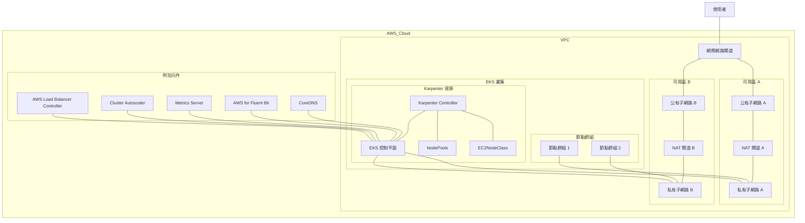

## Demo EKS Cluster 

這個專案使用 Terraform 部署一個完整的 AWS EKS 叢集，包含必要的網路設定和常用附加元件。

### 架構圖



### 先決條件
- AWS 帳戶及對應的權限，建議定義 AWS_PROFILE
- 已安裝 [Terraform](https://www.terraform.io/downloads.html) (需要版本 >= 1.4.0)
- 已安裝 [kubectl](https://kubernetes.io/docs/tasks/tools/install-kubectl/)
- 已設定 AWS CLI 與您的帳戶

### Infra Ref:
- [AWS VPC MODULE](https://github.com/terraform-aws-modules/terraform-aws-vpc)
- [AWS EKS MODULE](https://github.com/terraform-aws-modules/terraform-aws-eks)

### Addons Ref:
- [AWS EKS BLUEPRINT ADDONS MODULE](https://github.com/aws-ia/terraform-aws-eks-blueprints-addons)
- [AWS Load Balancer Controller](https://kubernetes-sigs.github.io/aws-load-balancer-controller/)
- [AWS FOR Fluent Bit](https://github.com/aws/aws-for-fluent-bit)
- [Metrics Server](https://github.com/kubernetes-sigs/metrics-server)
- [Karpenter](https://karpenter.sh/) - Kubernetes 節點自動調整器
- [CoreDNS](https://github.com/coredns/coredns) - Kubernetes DNS 服務
- [EC2NodeClass](https://karpenter.sh/docs/concepts/nodeclasses/) - Karpenter 節點範本定義
- [NodePools](https://karpenter.sh/docs/concepts/nodepools/) - Karpenter 節點池定義

### To Deploy
```bash
terraform apply -var="profile=$AWS_PROFILE"
```

### 獲取 kubeconfig
```bash
aws eks update-kubeconfig --name demo-eks-cluster --region <region_code> --profile $AWS_PROFILE
```

### To Destroy
```bash
terraform destroy -var="profile=$AWS_PROFILE"
```

### 有用資源
- [EKS 最佳實踐](https://aws.github.io/aws-eks-best-practices/)
- [Terraform AWS EKS 文檔](https://registry.terraform.io/providers/hashicorp/aws/latest/docs/resources/eks_cluster)
- [Kubernetes 官方文檔](https://kubernetes.io/docs/home/)
- [Karpenter 文檔](https://karpenter.sh/docs/)